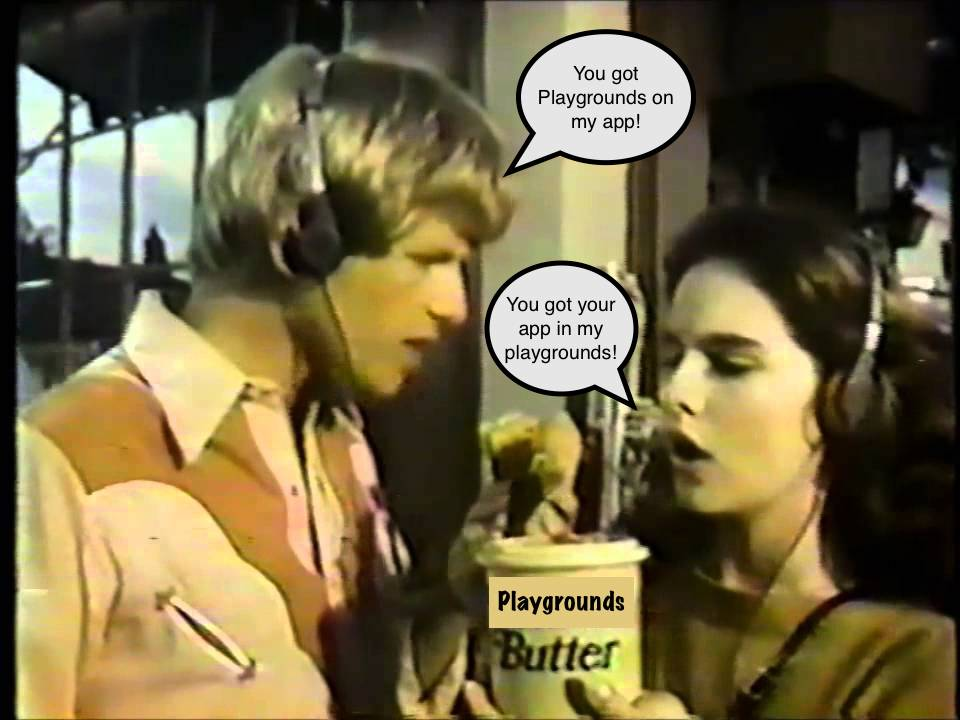

theme: Fira, 0
build-lists: true

## Playgrounds in Your Projects

#### Steven Thompson

^ Hello! My name is Steven, I'm going to talk very quickly about playgrounds!

---

### What's a Playground?

^ File that quickly runs your Swift code.

---

### Why is this useful for us?

- Playgrounds quickly show you the results of your code
- Playgrounds can `import` frameworks and other resources
- Playgrounds can display interactive UI

---

^ So how can this be useful in your project? Let's get going

^ You can have one playground and fill it up, or have multiple small ones, associated with specific parts of your app. Say this custom UI control you have, and you want to play around with how it looks.

^ Or you have something cool and clever but maybe it could do with some interactive documentation. How about a playground with working code examples of usage?

---

## Tips 

- @testable only gives you access to `public` and `internal` code.
- Don't create a test suite in a Playground
- Remember to `Bundle(for: type(of: self))`. And rebuild your framework frequently.

---

## Thank you!

#### @stevethomp
#### https://github.com/stevethomp/ViDIA-Playgrounds